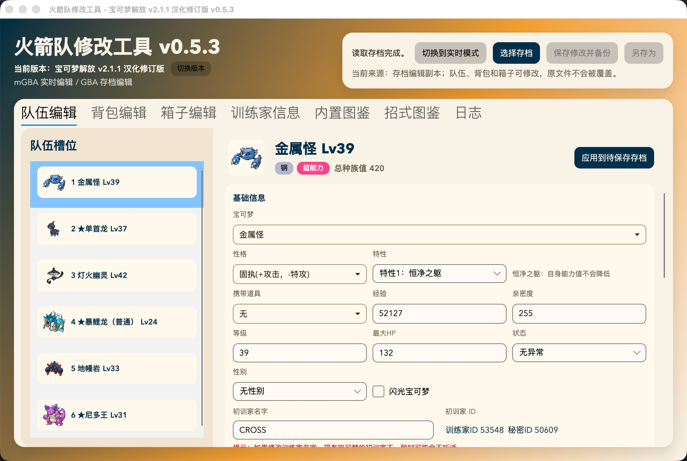
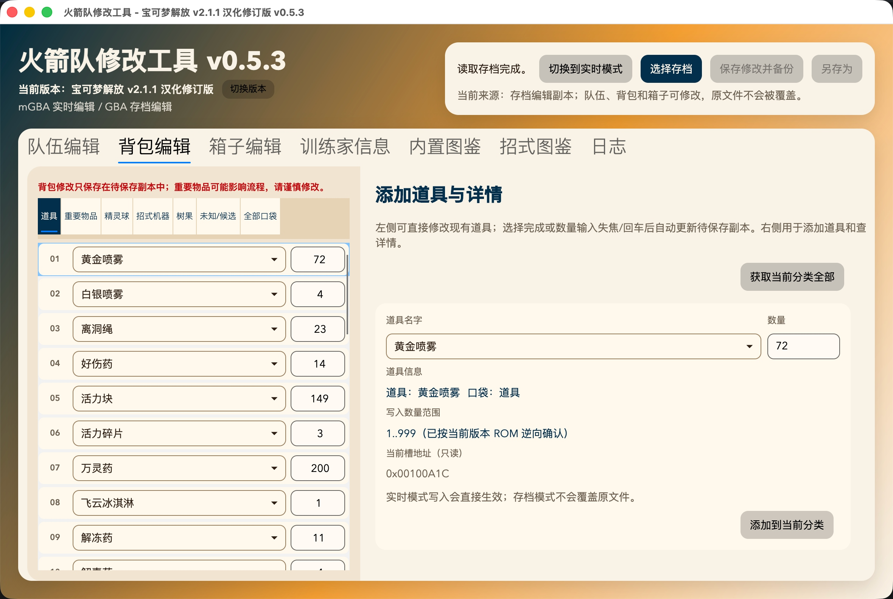
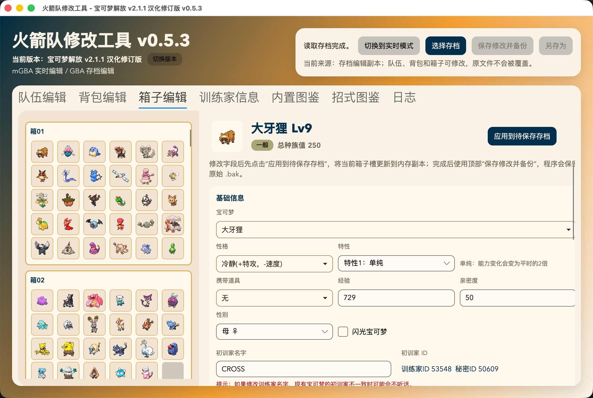
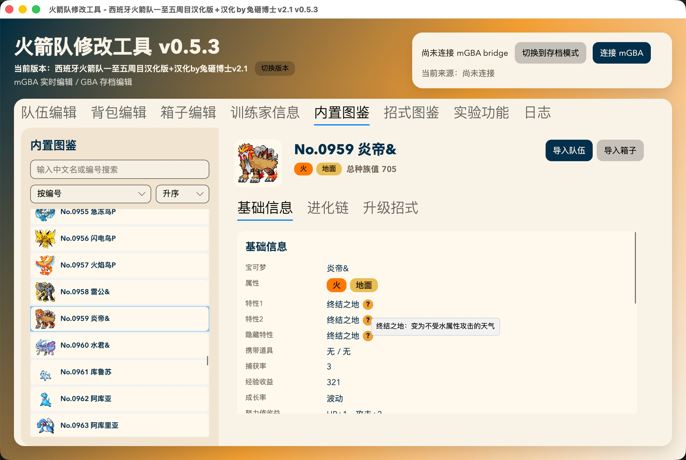

# 火箭队修改工具（RocketTool）

RocketTool 是一个面向 GBA 改版的跨平台中文修改器，支持实时连接 mGBA，也支持直接编辑 `.sav` / `.srm` 存档文件。

程序启动后需要先选择游戏版本。不同版本共用一套界面，但使用各自独立的数据和读写逻辑。

## 支持版本

- 西班牙火箭队一至五周目汉化版+汉化by兔砸博士v2.1
- 宝可梦解放 v2.1.1 汉化修订版

## 截图

### 队伍编辑



### 背包编辑



### 箱子编辑



### 内置图鉴



## 编辑模式

| 模式 | 说明 |
| --- | --- |
| mGBA 实时模式 | 连接正在运行的 mGBA，直接修改游戏内存 |
| 存档模式 | 读取 `.sav` / `.srm`，修改后保存并自动创建 `.bak` 备份 |

## 已实现功能

### 队伍编辑

- 查看和修改队伍宝可梦。
- 修改种类、道具、性格、性别、特性、闪光、等级、经验、亲密度、状态。
- 修改招式、PP、PP 提升、个体值和努力值。
- 显示宝可梦图片、属性、总种族值和能力预览。

### 箱子编辑

- 查看和修改 PC 箱子宝可梦。
- 支持队伍编辑中的主要宝可梦字段。
- 按箱子格子显示，方便定位和编辑。

### 背包编辑

- 查看和修改背包道具。
- 支持添加道具、修改数量、清空槽位。
- 支持批量获取当前分类道具。
- 支持获取全部技能机 / 秘传机。
- 解放版按游戏内口袋显示：道具、重要物品、精灵球、招式机器、树果。

### 训练家信息

- 查看训练家 ID、秘密 ID、金钱等信息。
- 修改训练家名字。
- 修改金钱。

### 内置图鉴

- 搜索宝可梦。
- 查看图片、属性、种族值、能力预览。
- 查看进化链和升级招式。
- 支持按种族值排序。
- 实时模式下可将宝可梦导入队伍或箱子。

### 招式图鉴

- 搜索招式。
- 查看属性、分类、威力、命中和 PP。
- 支持按属性和分类筛选。

### 实验功能

- 传送。
- 无限 PP。
- 锁血。
- 关闭遇怪。
- 穿墙。

实验功能会直接影响游戏运行状态，使用前建议先创建 mGBA 即时存档。

## 快速开始

### 编辑存档

1. 启动 RocketTool。
2. 选择游戏版本。
3. 切换到存档模式。
4. 点击 **选择存档**，打开 `.sav` 或 `.srm`。
5. 修改队伍、背包、箱子或训练家信息。
6. 点击 **保存修改并备份**。

第一次保存会创建 `<原文件名>.bak`。已有备份不会被覆盖。

### 连接 mGBA

1. 使用 mGBA 打开对应游戏。
2. 在 mGBA 中加载 [mgba_bridge.lua](mgba_bridge.lua)。
3. 启动 RocketTool，选择游戏版本。
4. 点击 **连接 mGBA**。
5. 修改需要的内容。
6. 回到游戏确认效果，并在游戏内正常存档。

## 构建运行

需要 .NET SDK 10。

```sh
dotnet build RocketTool.Cli/RocketTool.Cli.csproj --no-restore -p:UseSharedCompilation=false -p:BuildInParallel=false
dotnet build RocketTool.Avalonia/RocketTool.Avalonia.csproj --no-restore -p:UseSharedCompilation=false -p:BuildInParallel=false
```

运行图形界面：

```sh
dotnet run --project RocketTool.Avalonia/RocketTool.Avalonia.csproj
```

## 项目结构

```text
RocketTool.Avalonia/   桌面界面
RocketTool.Core/       核心读取、修改和保存逻辑
RocketTool.Cli/        调试和验证命令行工具
profiles/              游戏版本配置和数据表
docs/                  文档和截图
mgba_bridge.lua        mGBA 通信脚本
```

## 使用提醒

- 修改前先备份存档。
- 不要在模拟器正在保存时覆盖存档文件。
- 实时模式修改后，需要回游戏内正常存档。
- 重要物品、传送和实验功能可能影响剧情流程。
- 本工具只支持已适配的改版和版本，不是通用 GBA 存档编辑器。

## 免责声明

本项目用于个人研究、学习和存档管理。请自行合法获取游戏内容，并遵守所在地法律和相关作品的使用条款。

修改游戏内存和存档始终存在风险。作者与贡献者不对存档丢失、剧情异常或其他损失承担责任。
