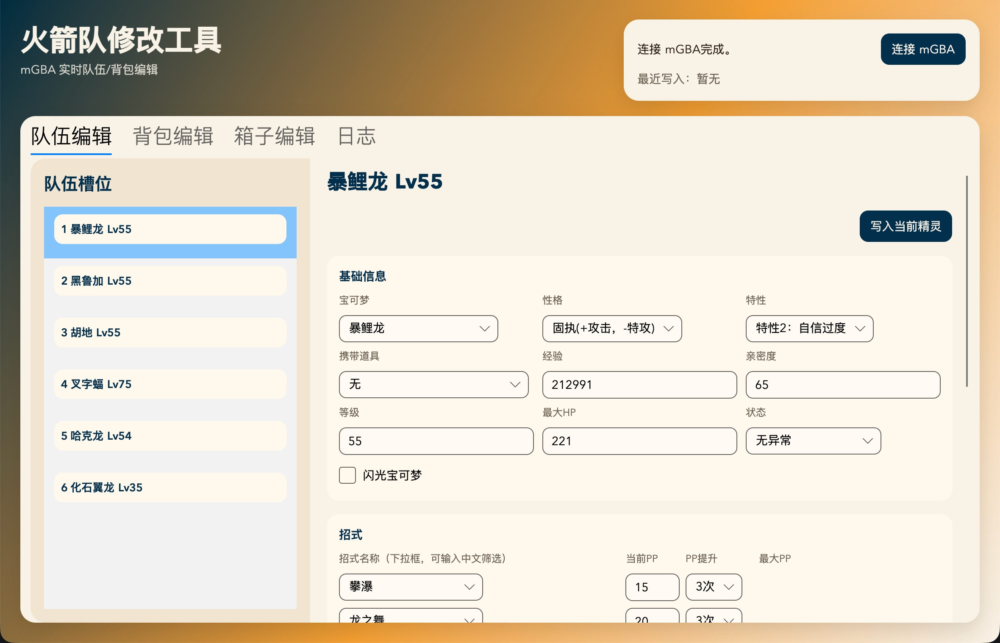
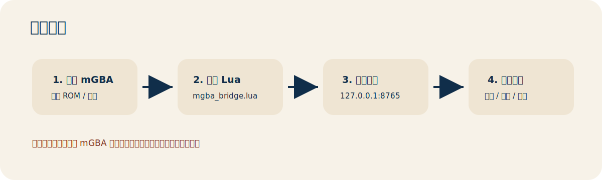

# RocketTool for mGBA

> 面向《西班牙火箭队》GBA 改版的 mGBA 实时修改工具。  
> 使用 C# / .NET / Avalonia 构建，通过 mGBA Lua bridge 读取和写入模拟器内存。



## 功能概览

- 队伍编辑：宝可梦、性格、特性、闪光、携带道具、经验、亲密度、等级、状态、最大 HP。
- 招式编辑：4 个招式、当前 PP、PP 提升次数、最大 PP 预览。
- 个体值 / 努力值：队伍和箱子都支持 IV / EV 编辑、当前值预览、种族值显示。
- 背包编辑：分类标签页、读取背包、校准背包、添加到当前背包、覆盖当前道具。
- 箱子编辑：读取非空箱子槽，编辑箱子宝可梦基础信息、招式、PP、PP 提升、IV / EV。
- 中文数据库：宝可梦、招式、道具、特性名表已内嵌，。


## 截图 / 流程



## 重要提醒

这是实时内存修改工具，不是普通存档编辑器。

- 写入会立即影响 mGBA 中正在运行的游戏。
- 修改前请先创建 mGBA 即时存档。
- 背包和箱子定位依赖当前内存状态，如列表和游戏不一致，请先重新读取或校准。
- 本项目主要针对《西班牙火箭队一至五周目汉化版+汉化by兔砸博士 v2.1》GBA 改版，不保证适配其他改版或原版。

## 运行要求

### 使用已发布版本

- mGBA 桌面版，需支持 Lua 脚本。
- 游戏 ROM 和对应存档。
- `mgba_bridge.lua` 脚本。

### 从源码构建

- .NET SDK 10 或项目当前使用的兼容 SDK。
- macOS / Windows / Linux 理论可构建，主要开发环境为 macOS + Avalonia。

## 快速开始

### 1. 启动 mGBA

打开 mGBA，加载《西班牙火箭队一至五周目汉化版+汉化by兔砸博士 v2.1》ROM 和你的存档。

### 2. 加载 bridge 脚本

在 mGBA 中打开脚本窗口，加载项目根目录下的：

```text
mgba_bridge.lua
```

mGBA 日志中应出现类似提示：

```text
[mgba-bridge] listening on 127.0.0.1:8765
```

默认连接地址：

```text
127.0.0.1:8765
```

### 3. 打开 RocketTool

运行程序后点击：

```text
连接 mGBA
```

连接成功后，工具会自动扫描队伍并刷新队伍列表。

### 4. 修改并写入

- 队伍编辑：选择左侧队伍槽，修改右侧信息，点击 `写入当前精灵`。
- 背包编辑：点击 `读取背包`，选择分类和槽位，再 `添加到当前背包` 或 `覆盖当前道具`。
- 箱子编辑：点击 `读取箱子`，选择箱子槽，修改后点击 `写入当前箱子精灵`。

## 页面说明

### 队伍编辑

队伍编辑页用于修改当前队伍中的 1-6 号宝可梦。

支持：

- 宝可梦种类、携带道具、性格、特性、闪光。
- 经验、亲密度、等级、最大 HP、状态。
- 4 个招式、当前 PP、PP 提升次数、最大 PP 预览。
- IV / EV 编辑、当前能力预览、种族值显示。
- `个体一键31` 和 `个体一键30`。

写入时会：

- 正确处理 Gen 3 加密子结构。
- 重算 checksum。
- 修改 IV / EV 后重新计算当前能力。
- 保持本改版的隐藏特性槽位规则。

### 背包编辑

背包编辑页按游戏中的口袋分类展示：

- 普通道具
- 回复药品
- 精灵球
- 战斗道具
- 树果
- 宝物
- 招式机器 / 秘传机器
- 重要物品
- 全部口袋

常用操作：

- `读取背包`：重新扫描当前存档内存中的背包数据。
- `校准背包`：当工具列表和游戏中显示不一致时，按每个口袋第一个道具和数量进行定位校准。
- `添加到当前背包`：已有同道具时累加数量，否则写入当前口袋的安全空槽。
- `覆盖当前道具`：覆盖左侧当前选中的背包槽。

注意：

- 普通道具有数量，重要物品通常没有数量概念，但底层槽位仍有数量字段。
- 数量写入限制为 `0..255`。
- 修改道具时只能选择当前分类允许的道具，避免写入口袋不匹配的数据。

### 箱子编辑

箱子编辑页用于扫描和修改 PC 箱子中的非空宝可梦槽。

支持：

- 宝可梦、携带道具、性格、特性、闪光。
- 经验、亲密度。
- 4 个招式、当前 PP、PP 提升次数、最大 PP 预览。
- IV / EV、当前值预览、种族值显示。

说明：

- Gen 3 BoxMon 本身不保存当前 HP、状态和直接等级。
- 箱子页显示的当前能力值，是根据经验和成长率推算等级后计算的预览。
- 当前箱子扫描优先定位连续非空槽位，空槽较多的箱子可能需要更多测试。

## 构建

进入 C# 目录：

```sh
cd csharp
```

构建 Avalonia UI：

```sh
dotnet build RocketTool.Avalonia/RocketTool.Avalonia.csproj --no-restore -p:UseSharedCompilation=false -p:BuildInParallel=false
```

构建 CLI：

```sh
dotnet build RocketTool.Cli/RocketTool.Cli.csproj --no-restore -p:UseSharedCompilation=false -p:BuildInParallel=false
```

## 开源许可

本项目使用 GNU General Public License v3.0（GPL-3.0）开源许可。

这意味着你可以自由使用、复制、修改和分发本项目；如果你分发基于本项目修改后的版本，也需要按照 GPL-3.0 的要求以相同许可证开源对应源码。

完整许可证文本请参考：[GNU General Public License v3.0](https://www.gnu.org/licenses/gpl-3.0.html)

## 免责声明

本项目仅用于个人研究、学习和自用修改。请自行备份存档，并遵守你所在地区的法律法规以及游戏、模拟器和 ROM 相关使用条款。项目不提供 ROM，也不包含任何商业游戏资源。
